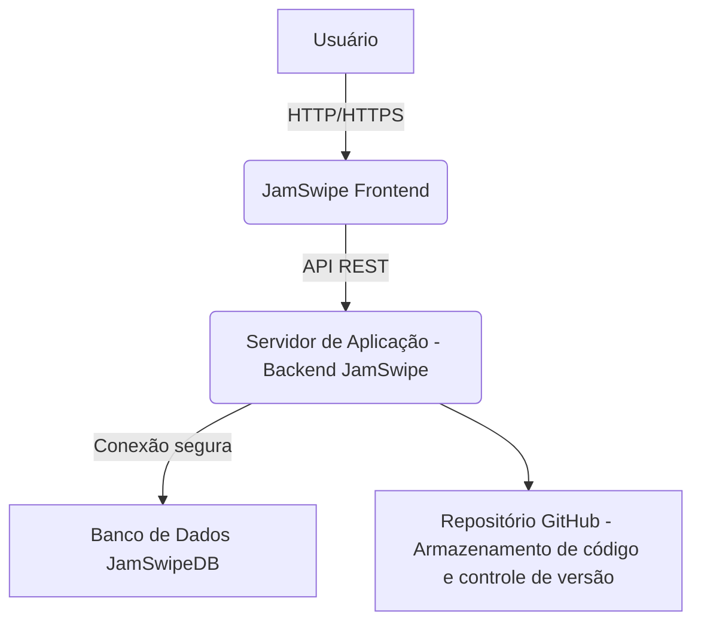

# Arquitetura e Requisitos do MVP JamSwipe

## 1. Visão Geral do Projeto

O JamSwipe é um aplicativo de descoberta musical que permite aos usuários ouvir prévias de músicas e interagir com elas através de gestos de 'deslizar' (swipe). O objetivo é proporcionar uma experiência interativa e divertida para explorar novos estilos musicais, conectando usuários a artistas e gravadoras.

## 2. Arquitetura Proposta

A arquitetura do MVP do JamSwipe será dividida em três camadas principais:

*   **Frontend (JamSwipe Frontend):** Interface do usuário desenvolvida com **React.js**. Comunicará com o backend via **HTTP/HTTPS** e **API REST**.
*   **Backend (Servidor de Aplicação - Backend JamSwipe):** Lógica de negócios e gerenciamento de dados desenvolvida com **Node.js**. Exporá uma **API REST** para o frontend e se conectará a um banco de dados.
*   **Banco de Dados (JamSwipeDB):** Armazenamento persistente dos dados da aplicação. Será acessado de forma segura pelo backend.

## 3. Requisitos Funcionais (MVP)

Baseado nos documentos fornecidos, os requisitos funcionais para o MVP incluem:

*   **Escutar prévias de músicas:** O sistema deve permitir que o usuário reproduza trechos de músicas.
*   **Interagir com a música:** O usuário deve ser capaz de indicar 'gostei' (deslizar para a direita) ou 'não gostei' (deslizar para a esquerda) em relação a uma música.
*   **Exibir informações da música:** A interface deve mostrar o título, artista e capa do álbum da música sendo reproduzida.
*   **Login e Autenticação:** O sistema deve oferecer um mecanismo seguro de login e autenticação para os usuários.

## 4. Requisitos Não Funcionais (MVP)

*   **Responsividade:** A aplicação deve ser responsiva, funcionando bem tanto em desktop quanto em dispositivos móveis.
*   **Baixo tempo de carregamento:** As prévias das músicas devem carregar rapidamente.
*   **Armazenamento seguro e persistente:** As preferências do usuário (curtidas/não curtidas) devem ser armazenadas de forma segura e persistente.
*   **Interface amigável:** A interface do usuário deve ser simples, intuitiva e amigável.
*   **Escalabilidade:** A arquitetura deve ser projetada para suportar um número crescente de usuários no futuro.

## 5. Casos de Uso (MVP)

Os principais casos de uso para o MVP são:

*   **Escutar Preview:**
    *   **Ator principal:** Usuário
    *   **Pré-condições:** Usuário logado e conectado à internet.
    *   **Fluxo Principal:** O sistema exibe uma música, o usuário clica em Play, o sistema reproduz o trecho.
    *   **Pós-condições:** O usuário pode decidir se gostou ou não.

*   **Curtir ou Não Curtir Música:**
    *   **Ator principal:** Usuário
    *   **Pré-condições:** Usuário escutando uma música.
    *   **Fluxo Principal:** Usuário desliza para direita (curtir) ou esquerda (não curtir), o sistema registra a escolha.
    *   **Pós-condições:** Histórico atualizado.

## 6. Modelo de Domínio (MVP)

Os principais conceitos do sistema e suas relações incluem:

*   **Usuário:** Atributos como nome, e-mail, senha.
*   **Música:** Atributos como título, artista, capa, preview (URL do áudio).
*   **Histórico:** Registros das interações do usuário com as músicas (curtidas/não curtidas), associado a um usuário e uma música.
*   **Autenticação:** Mecanismo para gerenciar o acesso do usuário.

## 7. Protótipos de Tela (MVP - Conceitual)

As telas essenciais para o MVP são:

*   **Tela de Login:** Para autenticação do usuário.
*   **Tela Principal (Swipe):** Onde as músicas são apresentadas e o usuário interage com gestos de swipe.
*   **Tela de Histórico:** Exibindo as músicas curtidas/não curtidas pelo usuário.

